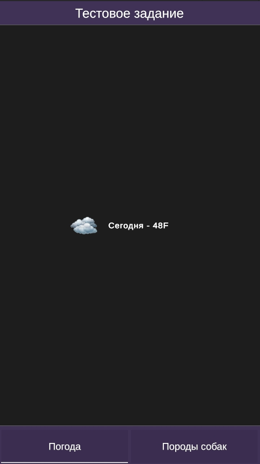
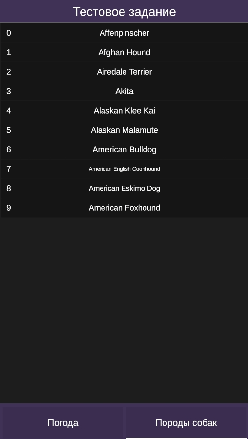
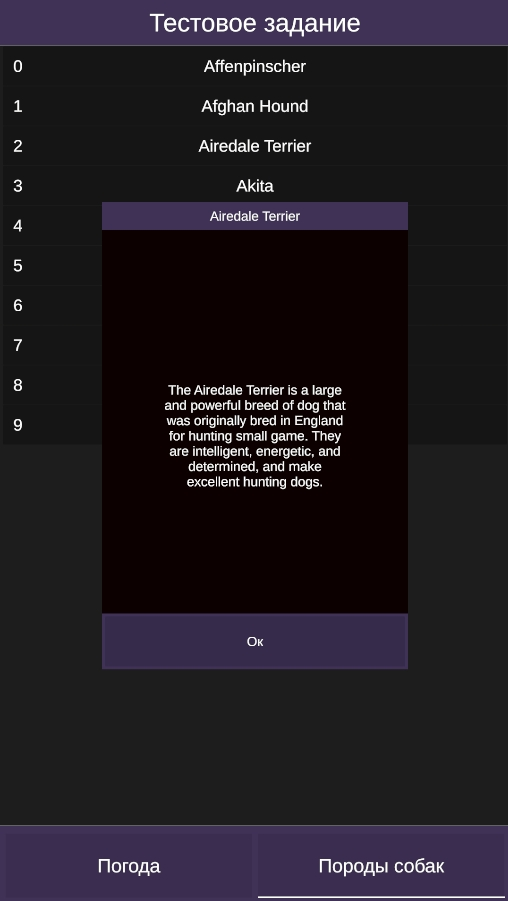

# 🔥 Cifkor_TestTask

## 📌 Краткое описание
**Cifkor_TestTask** — Проект смыслом которого является показать, умение работать с архитектурным паттерном MVC, Unity, DOTWeen, UnityWebRequest, Zenject.

---

## 🛠 Технологии
- Unity 2D (C#, UGUI) (ver 2022.3.53f1)
- DI: Zenject
- Асинхронность: UnityWebRequest
- Анимации: DOTween
- Архитектура: MVC
- VCS: Git

---

## 📸 Скриншоты / Видео

